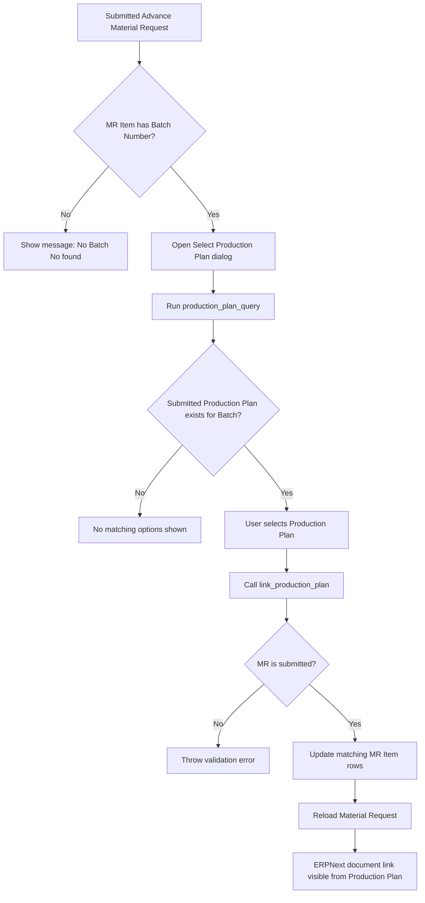
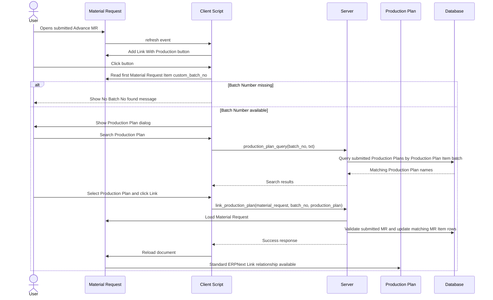

# Software Design Document: Advance Material Request - Production Plan Linking

## 1. Introduction

This document describes the ERPNext/Frappe v16 customization that links a submitted Advance Material Request to the correct Production Plan by using the Batch Number recorded on Material Request Item rows.

The feature was developed to solve a traceability gap in the planning process. Advance Material Requests can be created before the normal Production Plan driven Material Request workflow. These documents carry batch information, but without a Production Plan link the planning team cannot easily determine which Production Plan the Advance MR belongs to. The customization adds a controlled linking action so users can select only Production Plans that contain the same Batch Number and update the standard `production_plan` Link field on matching Material Request Item rows.

The document is intended for developers, technical consultants, QA engineers, and future maintainers.

## 2. Existing Process Before Enhancement

Before this enhancement, the process was:

```text
Sales Order
    |
Batch Generated
    |
User manually creates Advance Material Request
    |
User manually enters Batch Number
    |
Advance Material Request Submitted
```

At this point there was no reliable relationship between the Advance Material Request and the Production Plan.

| Problem | Impact |
| --- | --- |
| Planning team cannot identify which Production Plan the Advance MR belongs to. | Users must manually compare documents. |
| Users manually search Production Plans. | Planning effort increases as document volume grows. |
| No traceability between Advance MRs and Production Plans. | Auditing and production tracking become difficult. |
| Wrong Production Plans can be selected manually. | Incorrect planning references may be created. |
| Production Plan dashboard cannot display related Advance MRs. | Standard navigation and linked document visibility are incomplete. |
| Batch information exists but is not used for linking. | A reliable business key is ignored. |

## 3. Problem Statement

Although an Advance Material Request contains the Batch Number, there was no mechanism to associate it with the correct Production Plan. Users had to identify the Production Plan by checking multiple documents manually.

This caused manual effort, human errors, missing document traceability, difficult production tracking, and time-consuming planning activity.

## 4. Proposed Solution

The customization introduces a manual-but-filtered linking action for submitted Advance Material Requests.

When the user opens a submitted Material Request, the client script adds a linking button. The current UI label is **Link With Production**; the business feature name is **Link Production Plan**.

When clicked:

1. The client reads the first available Batch Number from `Material Request Item.custom_batch_no`.
2. A dialog asks the user to select a Production Plan.
3. The Production Plan Link field is filtered through a server query.
4. The query returns only submitted Production Plans whose Production Plan Item rows have the same `custom_batch_no`.
5. The user selects the Production Plan and clicks **Link**.
6. The server updates the standard `Material Request Item.production_plan` field for all rows in the Material Request with the same Batch Number.
7. ERPNext document links and dashboards can then show the relationship between the Production Plan and the Advance Material Request.

## 5. Business Flow

1. Sales Order is created.
2. Sales Order is submitted.
3. Batch Number is generated.
4. User manually creates the Advance Material Request.
5. User assigns the Batch Number to Material Request Item rows.
6. Advance MR is submitted.
7. User clicks the Production Plan linking button.
8. System reads the Batch Number from the Material Request Item.
9. System filters Production Plans by that Batch Number.
10. User selects the correct submitted Production Plan.
11. System updates `production_plan` in all matching MR Items.
12. Production Plan and Advance MR become linked through the standard Link field.

## 6. Functional Flow



## 7. Sequence Diagram



## 8. Technical Design

### Client Side

Source file: `apps/generate_item/generate_item/public/js/material_request.js`

| Component | Implementation | Responsibility |
| --- | --- | --- |
| Custom button | `refresh(frm)` adds **Link With Production** when `frm.doc.docstatus == 1`. | Exposes the linking action only after submission. |
| Dialog | `open_production_plan_dialog(frm)` creates a `frappe.ui.Dialog`. | Collects the Production Plan selection from the user. |
| Batch extraction | `frm.doc.items.find(d => d.custom_batch_no)?.custom_batch_no`. | Uses the first available MR Item Batch Number as the matching key. |
| Production Plan filtering | Dialog Link field `get_query()` calls `generate_item.utils.material_request.production_plan_query`. | Ensures the selectable Production Plans are restricted by Batch Number. |
| API call | Dialog primary action calls `generate_item.utils.material_request.link_production_plan`. | Sends MR name, Batch Number, and selected Production Plan to the server. |
| Reload document | On successful callback, `frm.reload_doc()` is executed. | Refreshes the form so linked item rows are visible. |

Implementation notes:

- The client currently checks submitted status through `docstatus == 1`.
- The business rule is that the action is for Advance MRs. The `advance_mr` custom field exists on Material Request, so the button visibility can be hardened by also checking `frm.doc.advance_mr` if required.
- The client reads the first Batch Number found in the item table. If an MR has multiple batches, the current flow links one batch per dialog invocation.

### Server Side

Source file: `apps/generate_item/generate_item/utils/material_request.py`

#### `production_plan_query`

`production_plan_query(doctype, txt, searchfield, start, page_len, filters)` is a whitelisted Frappe search query protected by `validate_and_sanitize_search_inputs`.

Behavior:

- Reads `batch_no` from `filters`.
- Searches submitted Production Plans only: `pp.docstatus = 1`.
- Joins `tabProduction Plan` with `tabProduction Plan Item`.
- Filters by `Production Plan Item.custom_batch_no = batch_no`.
- Applies the user's typed search text to `pp.name`.
- Returns distinct Production Plan names ordered by newest creation.
- Supports pagination through `start` and `page_len`.

#### `link_production_plan`

`link_production_plan(material_request, batch_no, production_plan)` is a whitelisted server method used by the dialog primary action.

Behavior:

- Loads the Material Request document.
- Validates that the Material Request is submitted (`docstatus == 1`).
- Iterates all child rows in `doc.items`.
- For every row where `row.custom_batch_no == batch_no`, updates `Material Request Item.production_plan`.
- Uses `frappe.db.set_value(..., update_modified=False)` because the parent document is submitted and the field is updated as a controlled post-submit link.
- Throws an error if no matching MR Item row exists for the Batch Number.
- Commits the database transaction and returns a success response.

## 9. Database Changes

| DocType | Field | Type | Source | Purpose |
| --- | --- | --- | --- | --- |
| Material Request | `advance_mr` | Check | Generate Item custom field | Identifies manually created Advance MRs. Used as the business classification for this feature. |
| Material Request Item | `custom_batch_no` | Link to Batch | Generate Item custom field | Stores the Batch Number used as the matching key between Advance MR and Production Plan. |
| Material Request Item | `production_plan` | Link to Production Plan | Standard ERPNext field | Stores the selected Production Plan and creates the ERPNext document relationship. |
| Production Plan Item | `custom_batch_no` | Link/Data batch reference | Generate Item customization | Stores the Batch Number on Production Plan rows so matching Production Plans can be queried. |

No new DocType or mapping table is required. The implementation reuses existing ERPNext and Generate Item fields.

## 10. Document Linking

ERPNext document links are created when a Link field stores the name of another document. In this feature, `Material Request Item.production_plan` stores the selected Production Plan name.

Because `production_plan` is a Link field with options set to `Production Plan`, ERPNext can discover the relationship without an additional mapping table. Dashboards, linked document queries, and standard navigation can use the child row Link field to show Advance Material Requests related to a Production Plan.

This approach avoids duplicate relationship data and keeps the source of truth in the transaction child row that requires the Production Plan reference.

## 11. Validation Rules

| Rule | Current enforcement | Expected behavior |
| --- | --- | --- |
| Material Request must be submitted. | Client shows button for `docstatus == 1`; server throws if `doc.docstatus != 1`. | Draft or cancelled MRs cannot be linked. |
| Advance MR checkbox should be enabled. | Field exists; current code does not enforce it server-side. | Recommended hardening: check `doc.advance_mr` before allowing link. |
| Batch Number must exist. | Client checks for at least one `custom_batch_no` in MR Items. | User sees "No Batch No found in Material Request Items." |
| Matching Production Plan must exist. | Query returns only submitted plans with matching batch. | User can select only valid matching plans. |
| Production Plan must be submitted. | Query filters `pp.docstatus = 1`. | Draft and cancelled plans are excluded. |
| Matching MR Item row must exist. | Server throws if no row has the requested Batch Number. | Prevents updating unrelated rows. |

## 12. Error Handling

| Scenario | Handling |
| --- | --- |
| No Batch Number on MR Items | Client displays a message and does not open the linking flow. |
| No matching Production Plan | Dialog search returns no selectable Production Plan. |
| Invalid Batch Number passed to server | Server finds no matching MR Item row and throws an error. |
| No MR Items | Client cannot find a Batch Number and stops the flow. |
| Material Request is not submitted | Server throws "Production Plan can only be linked to Submitted Material Requests." |
| Database failure | Frappe raises the database exception; transaction does not complete successfully. |
| Permission failure | Frappe permission or method access errors are surfaced to the user through the standard call response. |
| Production Plan deleted or invalid | Link field validation and database update fail through standard Frappe mechanisms if the selected document is not valid. |

## 13. Benefits

| Benefit | Description |
| --- | --- |
| Automatic linking support | Users no longer manually copy or infer the Production Plan relationship. |
| Batch-based filtering | The Batch Number becomes the source of truth for candidate Production Plans. |
| Reduced manual effort | Users select from a narrowed list instead of searching all Production Plans. |
| Improved planning | Planning users can see Advance MRs from the Production Plan context. |
| Better traceability | Material planning documents are tied to the originating production planning document. |
| Faster navigation | Standard ERPNext document links improve cross-document movement. |
| Reduced human error | Submitted and batch-matched filtering reduces incorrect selections. |
| Standard ERPNext approach | Uses Link fields and document dashboards instead of custom relationship tables. |
| Easy maintenance | The feature is implemented in one client script and one server utility module. |

## 14. Technical Advantages

- Uses standard ERPNext Link field behavior.
- Reuses the standard `Material Request Item.production_plan` field.
- Avoids duplicate relationship data.
- Avoids an additional child table or mapping DocType.
- Performs a minimal database update on only matching child rows.
- Keeps the Production Plan selector scalable through server-side search pagination.
- Uses `validate_and_sanitize_search_inputs` for the custom query method.
- Keeps logic maintainable through small, focused client and server functions.
- Can be reused for future batch-based linking workflows.

## 15. Future Enhancements

| Enhancement | Description |
| --- | --- |
| Auto-link during Production Plan creation | Automatically link eligible Advance MRs when a Production Plan is submitted or updated. |
| Bulk linking | Add a bulk utility to link multiple Advance MRs by Batch Number. |
| Auto unlink | Allow authorized users to clear an incorrect Production Plan link with validation. |
| Audit trail | Record linked by, linked on, old value, and new value in a custom log or Version entry. |
| Multiple Production Plans | Support explicit multi-plan handling if one MR batch can legitimately map to more than one Production Plan. |
| Permission-based linking | Restrict linking to planning roles or branch-specific users. |
| Notification after linking | Notify planners when an Advance MR is linked to a Production Plan. |
| Strong Advance MR validation | Enforce `advance_mr == 1` in both client visibility and `link_production_plan`. |
| Existing-link confirmation | Warn the user before overwriting an existing `production_plan` value on any MR Item row. |

## 16. Conclusion

The Advance Material Request - Production Plan Linking customization eliminates manual Production Plan identification by using the Batch Number as the matching key. It lets users link submitted Advance Material Requests to submitted Production Plans through a controlled dialog, updates the standard `production_plan` Link field on matching Material Request Item rows, and enables standard ERPNext traceability without adding duplicate tables or custom relationship records.

The design is intentionally small and maintainable: client-side code manages the user interaction and batch-aware filtering, while server-side code validates the submitted document and performs the controlled post-submit update. The result is better production traceability, reduced manual effort, and cleaner handover visibility for planning and QA teams.
