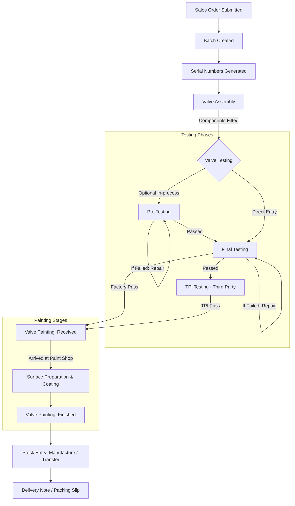

# Valve Manufacturing Operations Architecture

## Overview

In the Steelstrong ERP implementation, valve production operations follow a strict, serialized workflow spanning mechanical assembly, multi-stage pressure testing, and surface coating/painting before final stock receipt.

These processes are implemented in `apps/generate_item` through three core submittable DocTypes:
1. **[Valve Assembly](valve_assembly.md)** (`Valve Assembly` / `Assembly Item Serial No`)
2. **[Valve Testing](valve_testing.md)** (`Valve Testing` / `Valve Testing Item`)
3. **[Valve Painting](valve_painting.md)** (`Valve Painting` / `Valve Painting Item`)

Together, these DocTypes provide shop-floor traceability, enforce quality stage-gates, capture operator productivity, and compute capacity metrics through **Inspector Inches**.

---

## End-to-End Valve Manufacturing Lifecycle



### Operational Steps

1. **Serial Number Generation**:
   Approved valve Sales Orders generate custom serial numbers (`Serial Number` DocType) partitioned by branch and fiscal sequence.
2. **Valve Assembly**:
   Valves are assembled by technicians from department `"Valve assembly"`. Technical specifications are inherited from `Item Generator`, and Inspector Inches are calculated. A serial number can only be assembled once.
3. **Valve Testing**:
   Assembled valves undergo hydrostatic and pneumatic pressure testing:
   - **Pre Testing**: Preliminary checks for casting porosity or joint leaks.
   - **Final Testing**: Official API/ASME pressure testing. Once accepted, Final Testing is locked.
   - **TPI Testing**: Witnessed third-party inspection (requires prior Final Testing acceptance).
4. **Valve Painting**:
   Tested valves enter surface preparation and coating:
   - **Received**: Valves are logged into the painting department.
   - **Finished**: Coating application and DFT inspection are completed. Can only be performed against valves previously in "Received" state.
5. **Stock Entry Linking**:
   When the finished goods Stock Entry (`Manufacture`) is submitted, `Serial Number.stock_entry` is updated. Any serial number with a linked Stock Entry is strictly locked against further testing.

---

## The Inspector Inches Calculation Engine

### Purpose
In valve manufacturing, production capacity, machine throughput, and testing load are evaluated in terms of **Inspector Inches** rather than raw piece counts. This accounts for the exponential increase in material volume, handling time, and hydrostatic testing duration required as valve size and pressure class increase.

### Mathematical Formula

$$\text{Inspector Inches} = \text{Inches Factor} \times \text{Size Value}$$

Where:
- **Inches Factor** is derived from the valve's pressure rating/class (e.g., 150#, 300#, 600#, 1500#).
- **Size Value** is derived from the valve's nominal pipe size (e.g., 2", 4", 8", 12").

### Technical Implementation

The calculation engine resides in `generate_item/utils/inspector_inches.py`:

```python
def calculate_inspector_inches(inch_factor, size_value):
    if inch_factor is None or size_value is None or str(inch_factor).strip() == "" or str(size_value).strip() == "":
        return ""
    try:
        f = flt(inch_factor)
        v = flt(size_value)
        res = f * v
        return str(int(res)) if res == int(res) else f"{res:g}"
    except Exception:
        return ""
```

### Attribute Mapping Matrix

The engine looks up configuration records in the `Custom Item Attribute` master:

1. **Inches Factor**: Matches the valve's `class` / `rating` against the `logic_table.item_long_description` of Custom Item Attribute **"FG-Rating"** (or `"FG Rating"`).
2. **Size Value**: Matches the valve's `size` against the `logic_table.item_long_description` of Custom Item Attribute **"FG-Size"** (or `"FG Size"`).

### Dual-Layer Execution Safeguard
- **Client-Side**: When serial numbers are fetched via the "Get Item from Serial Register" dialog, `generate_item.utils.inspector_inches.get_inspector_inches` is called via RPC to immediately render `inch_factor`, `value`, and `inches` in the grid.
- **Server-Side**: During `before_save`, `calculate_doc_inspector_inches(self)` verifies all rows. If any attributes were manually edited or empty, it recomputes and stores the correct Inspector Inches in the database.

---

## Shop-Floor Employee & Department Tracking

Shop-floor execution accountability is tracked using the **General Employee** (`General Employee`) master:

| DocType | Field Name | UI Label | Department Filter |
| --- | --- | --- | --- |
| Valve Assembly | `assembled_by` | Assembled by | `Valve assembly` |
| Valve Testing | `tested_by` | Tested By | `Valve testing` |
| Valve Painting | `tested_by` | Painted By | `Valve painting` |

### Query Routing
All three DocTypes route employee lookups through `general_employee_by_department_query` in `general_employee.py`:
- Filters only active employees (`enabled = 1`).
- Matches the current document's `branch`.
- Strictly enforces the required manufacturing `department`.

---

## Shared Governance & Audit Controls

### 1. Fiscal Naming Series & Safe Reversion
Every valve manufacturing DocType uses branch-specific naming series prefixes:

| Branch | Valve Assembly | Valve Testing | Valve Painting |
| --- | --- | --- | --- |
| **Sanand** | `VASS.fiscal.#####` | `VTES.fiscal.#####` | `VPAS.fiscal.#####` |
| **Rabale** | `VASR.fiscal.#####` | `VTER.fiscal.#####` | `VPAR.fiscal.#####` |
| **Nandikoor** | `VASN.fiscal.#####` | `VTEN.fiscal.#####` | `VPAN.fiscal.#####` |

To prevent permanent numbering gaps when draft documents are trashed, `revert_series_on_trash(self)` checks if the record being deleted was the most recent in `tabSeries`. If so, it safely decrements the series counter.

### 2. Strict Posting Date & Back-Dating Controls
- `posting_date` defaults to `Today` and is read-only.
- **Future dates** are unconditionally blocked.
- **Past dates** are blocked unless an authorized user checks `allow_back_date`.
- Modifying `posting_date` automatically updates the row-level `date` across all child line items.
- Line items are also validated against future dates and unauthorized back-dating.

---

## Operations Reporting & Quality Analytics

| Report Name | Reference DocType | Primary Insights |
| --- | --- | --- |
| **[Valve Assembly Report](../reports/report_catalog.md#valve-assembly-report)** | `Valve Assembly` | Daily assembly throughput, operator output, batch distribution, total assembled inches. |
| **[Valve Testing Report](../reports/report_catalog.md#valve-testing-report)** | `Valve Testing` | First-pass yield, defect breakdown by leak reason, testing volume by phase (Pre/Final/TPI), tester efficiency. |

These reports provide full drill-down capabilities from Sales Order and Batch down to the individual serial number and its mechanical specifications.
